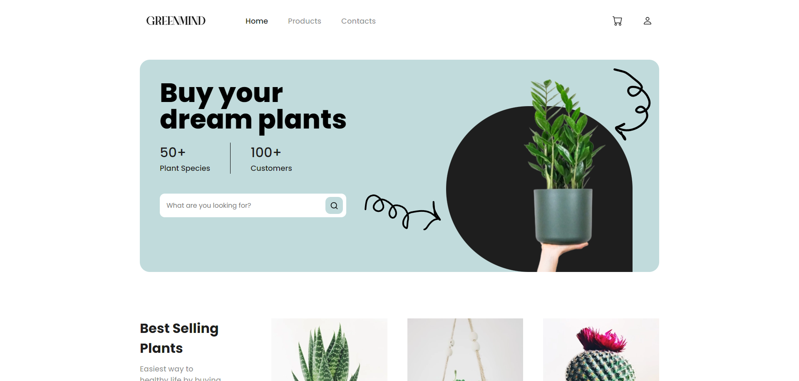

  

# 🌼 GreenMind

Projeto de um site de vendas de plantas naturais. Nesse projeto eu aproveitei para praticar bastante CSS, copiar Layouts do Figma e a minhas skills de responsividade. Fiz esse projeto com Next.js apenas para colocar em prática as coisas que apreendi e as otimizações de fonts e imagens.

- Veja o projeto: [Preview]()
- Layout do Projeto: [Figma](<https://www.figma.com/file/6lcApoJom8CYqXWQbZpsNr/E-Commerce-Plant-Shop-Website-(Community)?node-id=0%3A1&mode=dev>)

## ⚙️ Funcionalidades

- [x] Projeto feito a partir de um design público do Figma;
- [x] Menu mobile;
- [x] Site totalmente responsivo e intuitivo;
- [ ] Site com animações para aprimorar a experiência do usuário;
- [ ] Possui uma setinha para voltar ao topo;

## 🚀 Tecnologias

- [HTML](https://www.w3schools.com/html/)
- [CSS](https://developer.mozilla.org/pt-BR/docs/Web/CSS)
- [JavaScript](https://developer.mozilla.org/pt-BR/docs/Web/JavaScript)
- [Typescript](https://www.typescriptlang.org/)
- [React](https://react.dev/)
- [Next.js](https://nextjs.org/)

## 📝 Considerações

Fiz esse projeto com Next.js, desnecessário mas queria práticar as boas práticas do Next.js e a otimização de imagens;

Ainda falta a parte de interatividade do projeto, que irei deixar para depois para continuar outros projetos no momento.
